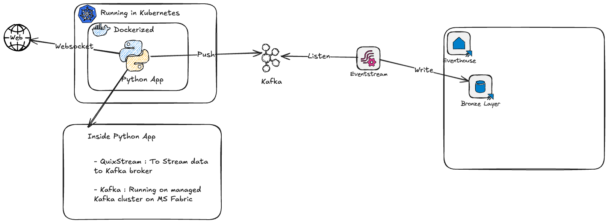

# RealTimeStreaming
Realtime data streaming through Kafka in MS Fabric

## Overview
This project implements a real-time data streaming pipeline using Apache Kafka and Microsoft Fabric Realtime Analytics. It processes and analyzes streaming data efficiently, leveraging modern streaming frameworks.

## Technologies Used
- QuixStream/Bytewax
- Apache Kafka
- Microsoft Fabric Realtime Analytics

## Technical Architecture
The architecture of this project is designed to handle real-time data ingestion, processing, and analytics. Below is a high-level overview:

1. **Data Producer**:
   - The `services/producer` module contains the logic for producing data streams.
   - [`kraken_websocket_api.py`](services/producer/kraken_websocket_api.py): Connects to the Kraken WebSocket API to fetch live trade data.
   - [`trade.py`](services/producer/trade.py): Processes trade data and prepares it for streaming.
   - Data is published to Kafka topics for downstream consumption.

2. **Message Broker**:
   - Apache Kafka is used as the message broker to handle real-time data streams.
   - Kafka ensures reliable and scalable data delivery between producers and consumers.

3. **Data Processing**:
   - QuixStream or Bytewax is used for stream processing.
   - These frameworks enable real-time transformations, aggregations, and analytics on the data streams.

4. **Analytics and Visualization**:
   - Microsoft Fabric Realtime Analytics is used to analyze the processed data.
   - Insights are visualized in dashboards for monitoring and decision-making.

5. **Configuration Management**:
   - The `services/producer/Config` directory contains configuration files:
     - [`Config.py`](services/producer/Config/Config.py): Centralized configuration for the producer module.
     - `settings.env`: Environment variables for sensitive data like API keys.

## Getting Started
1. Clone the repository.
2. Install dependencies using the `pyproject.toml` file in the `services/producer` directory.
3. Configure the environment variables in `settings.env`.
4. Run the producer script to start streaming data.

## Future Enhancements
- Add support for additional data sources.
- Implement advanced analytics using machine learning models.
- Enhance scalability with Kubernetes-based deployment.

Feel free to contribute or raise issues for improvements!